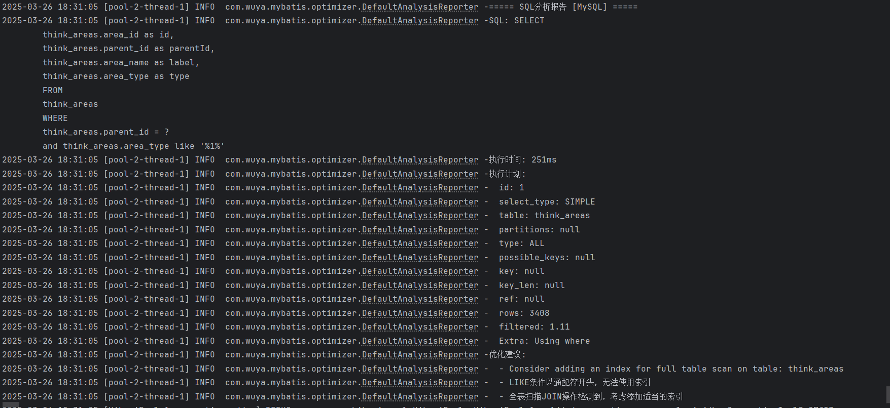

# mybatis-sql-optimizer-spring-boot-starter
这个starter可以帮助开发者在开发阶段发现SQL性能问题，并提供优化建议，从而提高应用程序的数据库访问效率。
# SQL 分析优化 Starter


一个基于 MyBatis 插件和 JSqlParser 解析器的 SQL 分析优化 Starter，提供 SQL 性能分析、优化建议、多数据库兼容支持，并支持同步/异步分析模式，采样率，自定义报告输出形式和自定义分析规则。

## 功能特性

- ✅ **SQL 性能分析** - 自动分析执行的 SQL 语句
- ✅ **优化建议** - 提供索引、改写等优化建议
- ✅ **多数据库兼容** - 支持 MySQL、Oracle、PostgreSQL 等主流数据库
- ✅ **灵活的分析模式** - 支持同步和异步分析模式
- ✅ **自定义规则** - 可扩展的分析规则配置
- ✅ **自定义报告输出规则** - 可扩展的报告输出。可以发送MQ，输出到日志、邮件、监控系统等
- ✅ **采样率控制** - 避免分析带来的性能开销
- ✅ **轻量无侵入** - 简单配置即可接入现有项目

## 快速开始

### 1. 添加依赖

```xml
<dependency>
    <groupId>com.wuya</groupId>
    <artifactId>sql-analyzer-spring-boot-starter</artifactId>
    <version>1.0.0</version>
</dependency>
```

### 2. 基础配置

```yaml
sql:
  analyzer:
    enabled: true # 启用分析器
    async-mode: true # 使用异步模式
    sample-rate: 0.5 # 采样率(0-1)
    rules: # 自定义规则
      - name: no-index-scan
        level: WARN
      - name: full-table-scan
        level: ERROR
```

### 3. 高级配置
#### 自定义分析规则

实现 `SqlOptimizationAdvice` 接口创建自定义规则：

```java
@Component
public class CustomAdvice implements SqlOptimizationAdvice {

    /**
     * 生成优化建议
     * @param explainResult
     * @return
     */
    @Override
    public List<String> generateAdvice(SqlExplainResult explainResult) {
        // 自定义分析逻辑
        List<String> adviceList = new ArrayList();
        String sql = explainResult.getSql();
        if (sql.contains("SELECT *")) {
            adviceList.add("避免使用SELECT *");
        }
        return adviceList;
    }

    /**
     * 是否支持该数据库类型
     * @param dbType
     * @return
     */
    @Override
    public boolean supports(DatabaseType dbType) {
        // 只支持PostgreSQL
        // 如果规则不区分数据库，直接return true;
        return dbType.equals(DatabaseType.POSTGRE);
    }
}
```

#### 报告处理

实现 `SqlAnalysisReporter` 接口自定义报告处理：

```java
@Component
public class CustomReporter implements SqlAnalysisReporter {
    
    @Override
    public void report(SqlExplainResult result, DatabaseType dbType) {
        // 发送到日志/邮件/监控系统等
        result.getAdviceList().forEach(result -> {
            log.info("SQL分析结果: {}", result);
        });
    }
}
```

###  4. 输出样例

## 功能详解

### 分析模式

- **同步模式**：立即分析并返回结果，适合开发环境
- **异步模式**：后台线程池处理，不影响主流程，适合生产环境

### 采样率控制

通过 `sample-rate` 配置采样比例，避免高频 SQL 带来的性能开销：

```yaml
sql:
  analyzer:
    sample-rate: 0.3 # 只分析30%的SQL
```


## 最佳实践

1. **开发环境**：使用同步模式，采样率设为1.0，快速发现问题
2. **测试环境**：使用异步模式，采样率0.5-0.8，平衡性能和分析覆盖率
3. **生产环境**：使用异步模式，采样率0.1-0.3，最小化性能影响

## 注意事项

1. 异步模式下，分析结果可能有延迟
2. 高采样率可能影响系统性能
3. 部分复杂SQL可能无法准确分析

## 参与贡献

欢迎提交 Issue 和 PR，贡献你的想法和代码。

## 许可证

Apache-2.0 License
